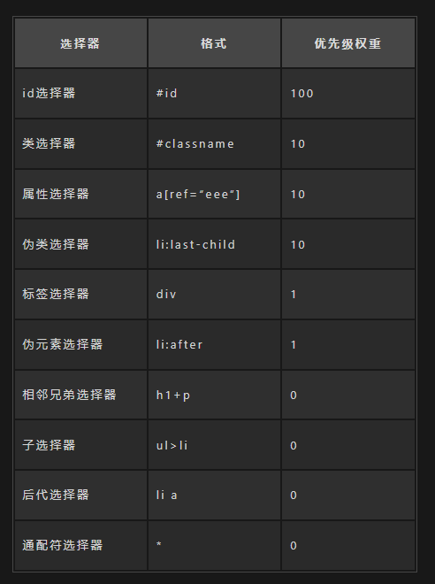

# html

### 1. 行内元素有哪些？块级元素有哪些？ 空(void)元素有那些？

行内元素有：a b span img input select strong；
块级元素有：div ul ol li dl dt dd h1 h2 h3 h4 h5 h6 p；

块级元素：
独占一行；元素的宽高、以及内外边距都可设置；元素宽度在不设置的情况下，是它本身父容器的 100%。
行内元素：
不会自动进行换行；元素的宽高不可设置；内边距可以设置、外边距水平方向有效，竖直方向无效；元素宽度在不设置的情况下，随内部元素的内容变化。

### 2. Cookie、sessionStorage、localStorage 的区别

共同点
都是保存在浏览器端！

区别
1）cookie 数据始终在同源的 http 请求中携带（即使不需要），即 cookie 在浏览器和服务器间来回传递；存储大小限制也不同，cookie 数据不能超 。
而 sessionStorage 和 localStorage 不会自动把数据发给服务器，仅在本地保存。sessionStorage 和 localStorage 虽然也有存储大小的限制，但比 cookie 大得多，可以达到 5M 或更大。
2） 数据有效期不同，sessionStorage：仅在当前浏览器窗口关闭前有效，自然也就不可能持久保持；localStorage：始终有效，窗口或浏览器关闭也一直保存，因此用作持久数据；cookie 只在设置的 cookie 过期时间之前一直有效，即使窗口或浏览器关闭。
3）作用域不同，sessionStorage 不在不同的浏览器窗口中共享，即使是同一个页面；localStorage 在所有同源窗口中都是共享的；cookie 也是在所有同源窗口中都是共享的。

1）session 和 cookie 有什么区别 ？
建议答案 ： session 是存储服务器端，cookie 是存储在客户端，所以 session 的安全性比 cookie 高。获取 session 里的信息是通过存放在会话 cookie 里的 session id 获取的。而 session 是存放在服务器的内存中里，所以 session 里的数据不断增加会造成服务器的负担，所以会把很重要的信息存储在 session 中，而把一些次要东西存储在客户端的 cookie 里。
session 的信息是通过 sessionid 获取的，而 sessionid 是存放在会话 cookie 当中的，当浏览器关闭的时候会话 cookie 消失，所以 sessionid 也就消失了，但是 session 的信息还存在服务器端
2）怎么给 localStorage 设置值，和获取值 ？
设置值：localStorage.setItem(键，值)
获取值：localStorage.getItem(键)

# css

### 1. CSS 选择器及其优先级


标签选择器、伪元素选择器：1
类选择器、伪类选择器、属性选择器：10
id 选择器：100
内联样式：1000

注意事项：

!important 声明的样式的优先级最高；
如果优先级相同，则最后出现的样式生效；
继承得到的样式的优先级最低；
通用选择器（\*）、子选择器（>）和相邻同胞选择器（+）并不在这四个等级中，所以它们的权值都为 0 ；
样式表的来源不同时，优先级顺序为：内联样式 > 内部样式 > 外部样式 > 浏览器用户自定义样式 > 浏览器默认样式。

### 2. 写一个 modal

#### 题目

```
<!DOCTYPE html>
<html lang="en">
  <head>
    <meta charset="UTF-8" />
    <meta http-equiv="X-UA-Compatible" content="IE=edge" />
    <meta name="viewport" content="width=device-width, initial-scale=1.0" />
    <title>Document</title>
  </head>
  <body>
    <button>open</button>
    <div class="modal" id="modal">
      <div class="modal-content" id="modal-content">
        <div class="modal-body">
          Lorem ipsum dolor sit amet, consectetur adipiscing elit.
        </div>
      </div>
    </div>
  </body>
  <script>
  </script>
</html>
```

```
<!DOCTYPE html>
<html lang="en">
  <head>
    <meta charset="UTF-8" />
    <meta http-equiv="X-UA-Compatible" content="IE=edge" />
    <meta name="viewport" content="width=device-width, initial-scale=1.0" />
    <title>Document</title>
    <style>
      * {
        margin: 0;
        padding: 0;
      }
      .modal {
        display: none;
        position: fixed;
        overflow: hidden;
        left: 0;
        top: 0;
        width: 100%;
        height: 100%;
        z-index: 999;
        background-color: rgba(0, 0, 0, 0.1);
      }
      .modal-content {
        position: absolute;
        left: 50%;
        top: 50%;
        transform: translate(-50%, -50%);
        width: 300px;
        height: 300px;
        box-shadow: 1px 1px 6px 4px rgb(223, 223, 223);
      }
      .modal-body {
        background-color: #2973af;
        width: 100%;
        height: 100%;
      }
    </style>
  </head>
  <body>
    <button onclick="openModal()">open</button>
    <div class="modal" id="modal">
      <div class="modal-content" id="modal-content">
        <div class="modal-body">
          Lorem ipsum dolor sit amet, consectetur adipiscing elit.          Aliquam
        </div>
      </div>
    </div>
  </body>
  <script>
    const modal = document.querySelector("#modal");
    const modalContent = document.querySelector("#modal-content");
    modal.addEventListener("click", (e) => {
      if (e.target == modal) {
        closeModal();
      }
    });
    function openModal() {
      modal.style.display = "block";
    }
    function closeModal() {
      modal.style.display = "none";
    }
  </script>
</html>
```

# js

### JS 的防抖与节流

#### 函数防抖（debounce）：当持续触发事件时，一定时间段内没有再触发事件，事件处理函数才会执行一次，如果设定的时间到来之前，又一次触发了事件，就重新开始延时

```
function debounce(fn, wait) {
    var timeout = null;
    return function() {
        if(timeout !== null)
                clearTimeout(timeout);
        timeout = setTimeout(fn, wait);
    }
}
// 处理函数
function handle() {
    console.log(Math.random());
}
// 滚动事件
window.addEventListener('scroll', debounce(handle, 1000));
```

#### 函数节流（throttle）：当持续触发事件时，保证一定时间段内只调用一次事件处理函数

```
const throttle = function(func, delay) {
    const timer = null;
    return function() {
        const context = this;
        const args = arguments;
        if (!timer) {
            timer = setTimeout(function() {
                func.apply(context, args);
                timer = null;
            }, delay);
        }
    }
}
function handle() {
    console.log(Math.random());
}
window.addEventListener('scroll', throttle(handle, 1000));
```

# 什么是宏任务与微任务？
我们都知道 Js 是单线程，但是一些高耗时操作就带来了进程阻塞问题。
为了解决这个问题，Js 有两种任务的执行模式：
同步模式（Synchronous）和异步模式（Asynchronous）。

### 在异步模式下，创建异步任务主要分为**宏任务**与**微任务**两种。
ES6 规范中，宏任务（Macrotask） 称为 Task， 微任务（Microtask） 称为 Jobs。宏任务是由宿主（浏览器、Node）发起的，而微任务由 JS 自身发起。
宏任务与微任务的几种创建方式 👇

## 宏任务（Macrotask）
1. setTimeout
2. setInterval
3. MessageChannel
4. I/O，事件队列
5. setImmediate（Node环境）
6. script（整体代码块）

## 微任务（Microtask）
1. requestAnimationFrame（有争议）
2. MutationObserver（浏览器环境）
3. Promise.[ then/catch/finally ]
4. process.nextTick（Node环境）
5. queueMicrotask

```
console.log("output1");
setTimeout(function() {
  console.log("timeout");
}, 0);
Promise.resolve()
  .then(function() {
    console.log("promise1");
  })
  .then(function() {
    console.log("promise2");
  });
console.log("output2");

#输出结果为
output1
output1
promise1
promise2
定时器
```